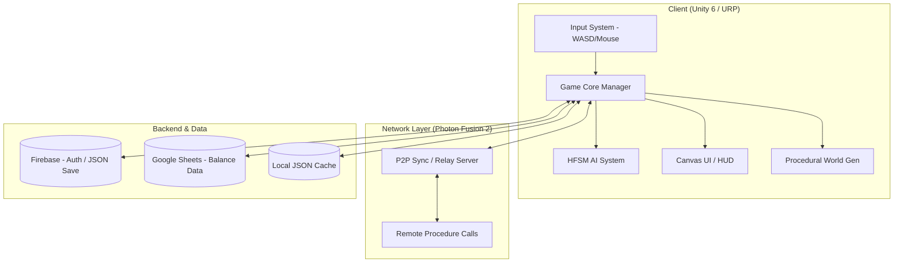

# 시스템 개요 (System Overview)

## 1. 사업의 목표 (Business Goals)
- **독창적 생존 경험 제공**: 1인칭 시점의 몰입감과 '달의 위상'이라는 천체 요소를 결합하여 기존 생존 게임과 차별화된 재미 전달.
- **높은 재플레이 가치 확보**: 시드 기반의 절차적 지형 생성 시스템을 통해 매 판 새로운 탐험 환경 제공.
- **협동 중심의 멀티플레이**: 최대 4인 P2P 멀티플레이를 통해 유저 간 역할 분담(채집, 전투, 건설) 및 커뮤니티 형성 유도.
- **안정적 데이터 기반 운영**: Google Sheets(UGS) 연동을 통해 코드 수정 없이 실시간으로 게임 밸런스를 조정할 수 있는 유연한 개발 환경 구축.

## 2. 추진 범위 (Project Scope)
- **클라이언트**: Unity 6 기반의 1인칭 생존 액션 엔진 개발 (HFSM 상태 머신 적용).
- **네트워크**: Photon Fusion 2를 활용한 P2P 세션 관리 및 실시간 동기화 구현.
- **백엔드**: Firebase를 이용한 사용자 인증 및 세이브 데이터(JSON) 클라우드 백업.
- **콘텐츠**:
    - 5종 생존 스탯(허기, 정신력, 체력, 체온, 습도) 시스템.
    - 3단계 연구 테크트리 및 크래프팅 시스템.
    - 만월 주기 보스 레이드 및 최종 엔딩 시퀀스.

## 3. 시스템 구성도 (System Architecture)

## 4. 전체 시스템 범위 (System Boundary)
| 구분 | 포함 범위 | 비고 |
| :--- | :--- | :--- |
| **인프라** | Photon Cloud (Relay), Firebase Cloud | 별도 서버 호스팅 미사용 |
| **데이터** | 아이템/레시피/바이옴/스탯/저장데이터 | JSON 및 SO 기반 관리 |
| **플랫폼** | PC Standalone (Windows) | 추후 모바일 확장성 고려 |
| **서비스** | 1~4인 협동 플레이 전용 | 싱글 플레이 포함 |
